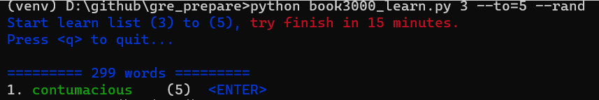
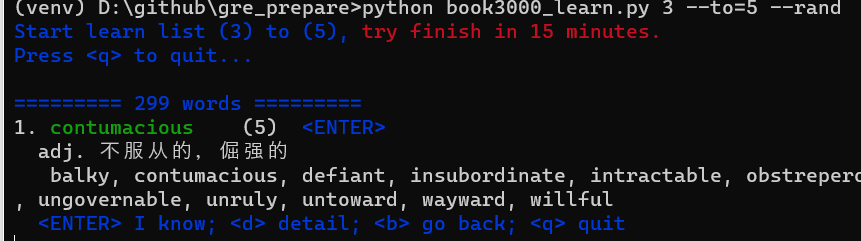
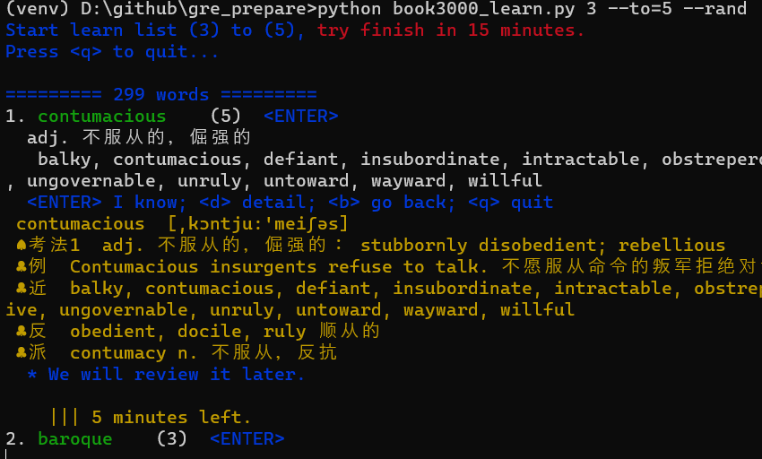
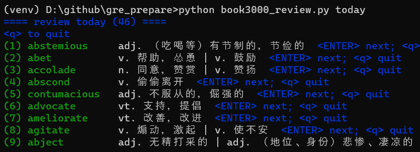
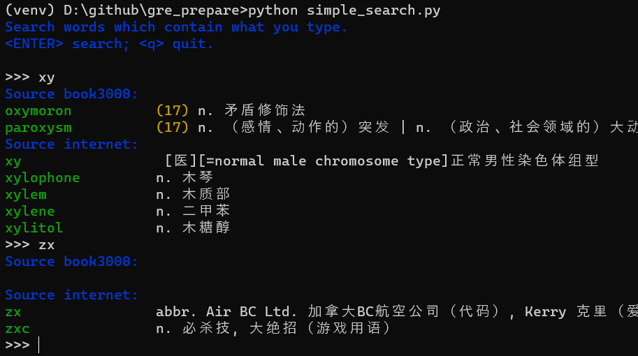

# GRE 词汇工具
*整理了自己准备 GRE verbal 时用于辅助背单词工具 :)*

* [背 3000 词](##1.-背-3000-词)
* [复习](##2.-复习)
* [快速查词](##3.-快速查词)

## 主要功能
* 集成了 GRE 必背的 3000+ 词
    * 可按章节
    * 记录不会的单词，并提示复习
    * 计时，帮助提高效率
* 提供一个辞典搜索工具，以帮助记录 reading 中不会的词
    * 记录搜索同一个词的频率
    * 提示复习高频搜索词
* 另一个更简单的搜索工具，帮我们确认一些“眼熟”的词

## Requirement & Install
1. 安装 [python3](https://www.python.org/downloads/)
2. 安装 pip
3. `pip install -r requirements.txt`

## 1. 背 3000 词

```py
# 学习 List 3
python book3000_learn.py 3
```
```py
# 学习 List 3 到 List 5
python book3000_learn.py 3 --to=5
```
```py
# 学习 List 3 到 List 5, 并随机顺序
python book3000_learn.py 3 --to=5 --rand
```
[更多参数](#)

#### 显示单词


#### `<ENTER>` 显示提示


#### `<d>` 显示详解，并记录这个词


#### 列表中间会随机插入之前不会的词

## 2. 复习

```py
# 复习今天的学习的单词
python book3000_review.py today
```
```py
# 复习最近几天的学习的单词
python book3000_review.py recent
```

#### 快速 review


## 3. 快速查词

```py
python simple_search.py
```

#### 显示 3000 词中的匹配词，同时连网查词



## todo:
* fix iciba search


